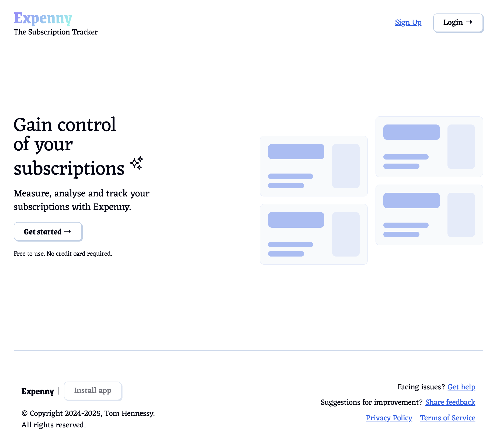
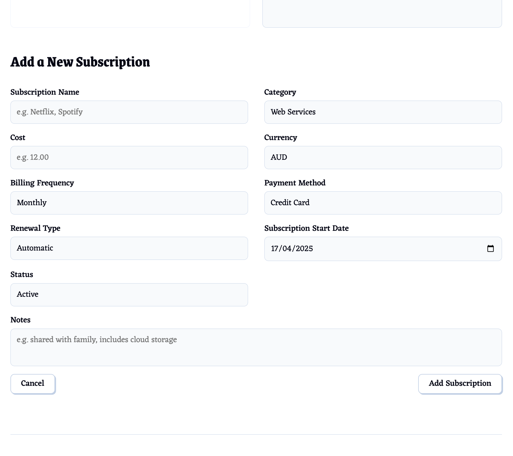
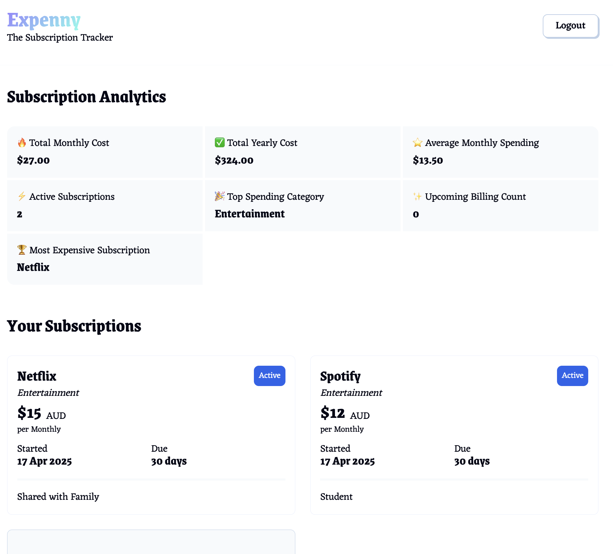

# Expenny – The Subscription Tracker 💸

Track, manage, and analyse your subscriptions — powered by a fullstack .NET + React architecture.
Built to showcase clean C# backend logic, real-world authentication, and cloud deployment.

---

## 🧰 Tech Stack

**Backend:**
- ASP.NET Core Web API (C#)
- Entity Framework Core + Azure SQL
- ASP.NET Identity + JWT Auth
- Clean architecture (DTOs, Repositories, Services)

**Frontend:**
- React + Next.js (App Router)
- Token-based auth integration
- Fully responsive UI

**DevOps:**
- Deployed on **Azure App Service** + **Azure SQL**
- Frontend hosted on **Vercel**
- Swagger API docs

---

## 🔐 Features

✅ **User Authentication**
- Secure registration/login via email + password
- Token-based auth with protected endpoints

📊 **Analytics Dashboard**
- Total monthly/yearly spend
- Average monthly spend
- Active subscription count
- Upcoming billing (7 days)
- Most expensive sub
- Top spending category

📁 **Subscription Management**
- Add/edit/delete subscriptions
- Filtered by `UserId` using JWT


📦 **Live Demo:**

🧪 **Frontend (Next.js):**
[https://expenny-fullstack.vercel.app](https://expenny-fullstack.vercel.app)

📘 **API Swagger Docs:**
[https://expenny-api-79450e.azurewebsites.net/swagger/index.html](https://expenny-api-79450e.azurewebsites.net/swagger/index.html)

---

## 📸 Screenshots

| Dashboard | Add Subscription | Analytics |
|----------|------------------|-----------|
|  |  |  |

---

## 🧠 Backend Design Patterns

- 🔄 **Repository Pattern** – abstracts EF Core logic
- 📦 **DTOs** – separate internal models from API contracts
- 🔐 **JWT Auth** – scoped data per user with `User.FindFirst(...)`
- 🧠 **AnalyticsService** – contains all core calculations
- 🔍 **Swagger UI** – for testing and exploring API endpoints

```csharp
// Securely calculate subscription metrics for the current user
[Authorize]
[HttpGet("analytics")]
public ActionResult<SubscriptionAnalyticsDTO> GetAnalytics()
{
    var userId = User.FindFirst(ClaimTypes.NameIdentifier)?.Value;
    var subs = _repo.GetByUserId(userId).ToList();
    var result = _analytics.CalculateMetrics(subs);
    return Ok(result);
}
